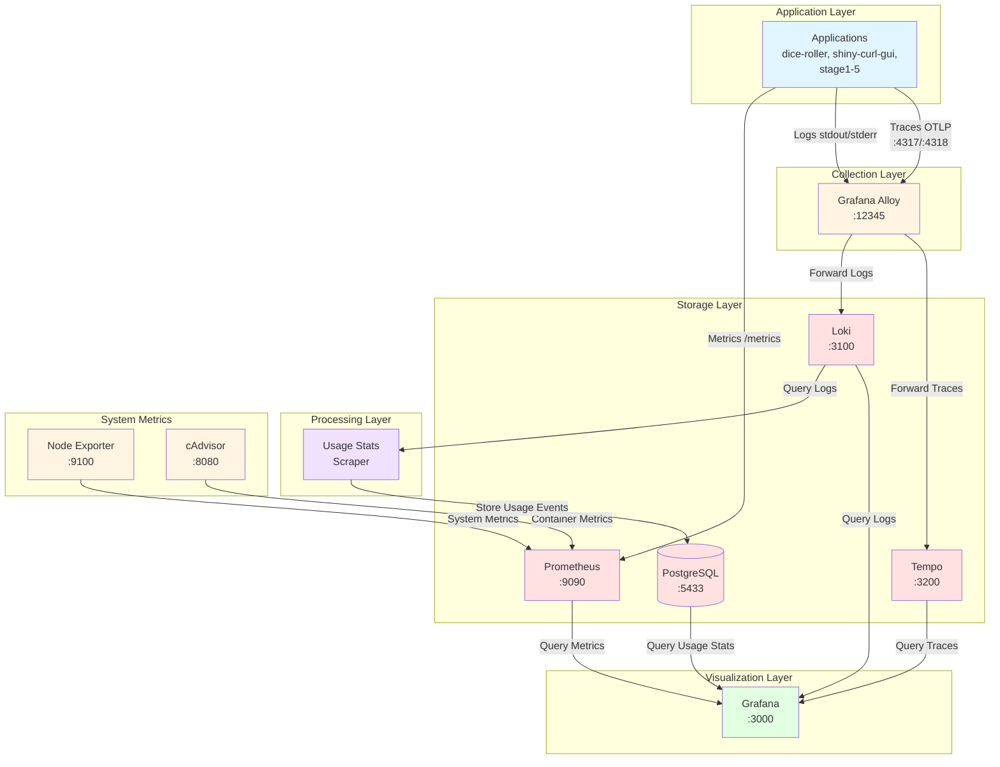

# Observability Stack Data Flow

## Node Roles

### Application Layer
- **Applications**: Demo apps and progressive stages that generate metrics, logs, and traces

### Collection Layer
- **Grafana Alloy** (:12345): Unified collector that:
  - Discovers Docker containers via Docker socket
  - Collects logs from container stdout/stderr
  - Receives OTLP traces on ports 4317 (gRPC) and 4318 (HTTP)
  - Parses JSON logs to extract trace_id, span_id, level
  - Forwards logs to Loki and traces to Tempo

### Storage Layer
- **Prometheus** (:9090): Time-series database for metrics
  - Scrapes `/metrics` endpoints from applications
  - Scrapes system metrics from Node Exporter and cAdvisor
  - 15-second scrape interval

- **Loki** (:3100): Log aggregation and storage
  - Receives logs from Alloy with labels (container_name, job, compose_project, compose_service)
  - 31-day retention period
  - Queryable via LogQL

- **Tempo** (:3200): Distributed tracing storage
  - Receives traces from Alloy via OTLP
  - 48-hour retention period
  - Local storage backend

- **PostgreSQL** (:5433): Relational database for usage statistics
  - Stores parsed usage events from logs
  - Database: usage_stats

### Processing Layer
- **Usage Stats Scraper**: Python service that:
  - Polls Loki every 60 seconds
  - Queries for logs with `usage=true` field
  - Extracts and stores usage events in PostgreSQL
  - Looks back 2 minutes for new logs

### Visualization Layer
- **Grafana** (:3000): Unified observability UI
  - Queries Prometheus for metrics visualization
  - Queries Loki for log exploration
  - Queries Tempo for trace visualization
  - Queries PostgreSQL for usage statistics
  - Provides trace-to-logs correlation
  - Hosts pre-configured dashboards

### System Metrics
- **Node Exporter** (:9100): Exports host system metrics
  - CPU, memory, disk, network statistics
  - Scraped by Prometheus

- **cAdvisor** (:8080): Exports container metrics
  - Container resource usage and performance
  - Scraped by Prometheus
