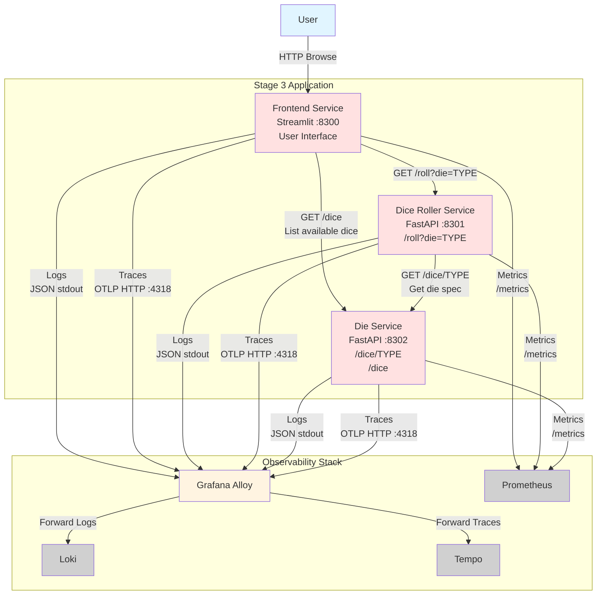

# Stage 3: Three-Service Architecture with Die Specifications

## Node Roles

### Application Components

- **Frontend Service** (:8300): Streamlit web application
  - **Functionality**: Enhanced UI for dice rolling with die selection
    - Fetches available dice from Die Service on page load
    - Dropdown to select die type (fair, risky, lucky, etc.)
    - Button to trigger roll
    - Display roll results and die specifications
  - **API Calls**:
    - `GET /dice` to Die Service - retrieve list of available dice
    - `GET /roll?die=TYPE` to Dice Roller - execute roll
  - **Metrics**: HTTP request metrics for outbound calls
  - **Logs**: JSON logs with trace context
  - **Traces**: Root spans for user interactions, client spans for API calls

- **Dice Roller Service** (:8301): FastAPI backend for dice rolling
  - **Endpoint**: `GET /roll?die={TYPE}`
  - **Functionality**:
    - Receives roll request with die type
    - Fetches die specification from Die Service
    - Executes roll based on specification's probability distribution
    - Returns roll result
  - **API Calls**: `GET /dice/{TYPE}` to Die Service
  - **Metrics**: HTTP metrics + custom counters for rolls by die type
  - **Logs**: JSON logs with trace context
  - **Traces**: Server spans for incoming requests, client spans for Die Service calls

- **Die Service** (:8302): FastAPI service for die specifications
  - **Endpoints**:
    - `GET /dice` - returns list of all available die types
    - `GET /dice/{TYPE}` - returns specification for a specific die
  - **Functionality**: Serves die specifications from JSON file
    - Die specs include: name, sides, probabilities array
    - Examples: fair (equal probabilities), risky (weighted), lucky (favors high numbers)
  - **Data Storage**: JSON file with die specifications
  - **Metrics**: HTTP request metrics
  - **Logs**: JSON logs with trace context
  - **Traces**: Server spans for incoming requests

### Traffic Flow

1. User opens Frontend → Frontend fetches available dice from Die Service
2. User selects die type and clicks roll
3. Frontend sends roll request to Dice Roller (with trace context)
4. Dice Roller fetches die specification from Die Service (trace context propagated)
5. Dice Roller executes roll and returns result
6. Frontend displays result to user

### Distributed Tracing

- **Trace Propagation**: Frontend → Dice Roller → Die Service via W3C trace context headers
- **Trace Structure**:
  - Root span: Frontend user interaction
  - Child span: Frontend → Dice Roller HTTP request
  - Child span: Dice Roller → Die Service HTTP request
- **Service Graph**: Three-tier architecture visible in trace waterfall
- **Correlation**: All three services include trace_id/span_id in logs

### Observability Data Generated

- **Metrics**: HTTP metrics from all three services, dice roll counters
- **Logs**: Request/response logs from all services with trace correlation
- **Traces**: Multi-span distributed traces showing Frontend → Dice Roller → Die Service call chain
- **Service Dependencies**: Traces reveal service dependency graph (Dice Roller depends on Die Service)
- **Dashboards**: Visualize request rates, latencies, and error rates across all three services
