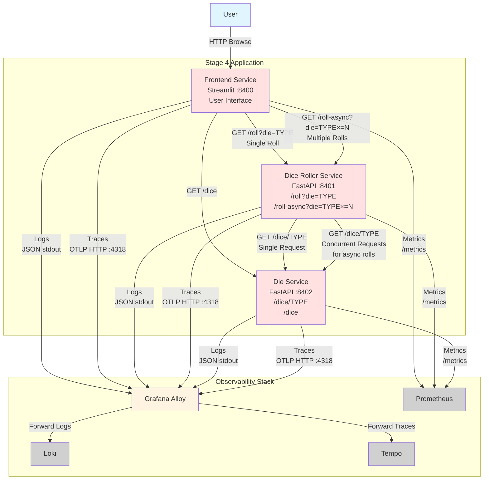

# Stage 4: Async Rolling with Concurrent Operations

## Node Roles

### Application Components

- **Frontend Service** (:8400): Streamlit web application
  - **Functionality**: Enhanced UI with sync and async rolling options
    - Dropdown to select die type
    - **Single Roll**: Button to execute one roll via `/roll` endpoint
    - **Multiple Rolls**: Number input and button to execute N rolls via `/roll-async` endpoint
    - Display individual roll results and aggregate statistics
  - **API Calls**:
    - `GET /dice` to Die Service
    - `GET /roll?die=TYPE` for single rolls
    - `GET /roll-async?die=TYPE&times=N` for multiple concurrent rolls
  - **Metrics**: HTTP request metrics, request duration by endpoint
  - **Logs**: JSON logs with trace context
  - **Traces**: Root spans for user interactions, shows both sync and async patterns

- **Dice Roller Service** (:8401): FastAPI backend with async capabilities
  - **Endpoints**:
    - `GET /roll?die={TYPE}` - Single synchronous roll
    - `GET /roll-async?die={TYPE}&times={N}` - Multiple concurrent rolls (NEW)
  - **Functionality**:
    - **Sync Roll**: Fetches die spec, executes single roll
    - **Async Roll**: Fetches die spec once, then executes N rolls concurrently using asyncio
      - Creates separate spans for each concurrent roll operation
      - Returns array of results
  - **API Calls**: `GET /dice/{TYPE}` to Die Service
  - **Metrics**: HTTP metrics + counters by endpoint type (sync vs async), roll distribution
  - **Logs**: JSON logs with trace context
  - **Traces**:
    - Sync: Linear spans (server → client → die service)
    - Async: Parallel child spans showing concurrent roll operations

- **Die Service** (:8402): FastAPI service for die specifications
  - **Endpoints**: Same as Stage 3
    - `GET /dice` - list all dice
    - `GET /dice/{TYPE}` - get specific die spec
  - **Functionality**: Serves die specifications from JSON file
  - **Load Pattern**: Receives single request per sync roll, potentially many concurrent requests for async rolls
  - **Metrics**: HTTP request metrics, rate of requests
  - **Logs**: JSON logs with trace context
  - **Traces**: Server spans for incoming requests

### Traffic Flow

#### Single Roll Flow (Same as Stage 3)
1. User selects die and clicks "Roll Once"
2. Frontend → Dice Roller `/roll?die=TYPE`
3. Dice Roller → Die Service `/dice/TYPE`
4. Roll executed, result returned

#### Async Roll Flow (NEW)
1. User selects die, enters number (e.g., 10), clicks "Roll Multiple"
2. Frontend → Dice Roller `/roll-async?die=TYPE&times=10`
3. Dice Roller → Die Service `/dice/TYPE` (once to get spec)
4. Dice Roller executes 10 concurrent roll operations (asyncio)
5. Array of 10 results returned to Frontend
6. Frontend displays individual results + statistics

### Distributed Tracing - Key Difference

- **Trace Propagation**: Same as Stage 3 (W3C trace context headers)
- **Trace Structure for Async Rolls**:
  - Root span: Frontend user interaction
  - Child span: Frontend → Dice Roller `/roll-async` request
  - Child span: Dice Roller → Die Service request
  - **Multiple parallel child spans**: One for each concurrent roll operation within Dice Roller
    - Shows concurrent execution visually in trace waterfall
    - Demonstrates async/parallel processing patterns
- **Performance Insights**: Traces reveal:
  - Time savings from concurrent operations
  - Overhead of asyncio coordination
  - Die Service load under concurrent requests

### Observability Data Generated

- **Metrics**: HTTP metrics from all services, roll counters by sync/async type
- **Logs**: Request/response logs with trace correlation, logs for each concurrent operation
- **Traces**:
  - Single-path traces for sync rolls
  - Multi-span concurrent traces for async rolls showing parallelism
- **Concurrency Patterns**: Traces visualize the difference between sequential and parallel operations
- **Dashboards**: Compare sync vs async performance, visualize concurrent operation metrics
