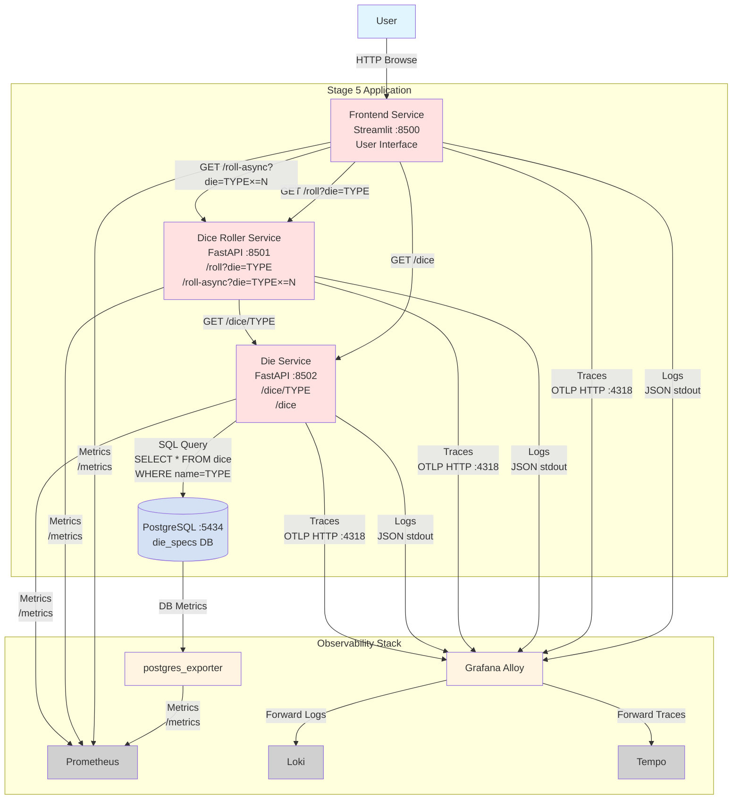

# Stage 5: Full Stack with Database Backend

## Node Roles

### Application Components

- **Frontend Service** (:8500): Streamlit web application
  - **Functionality**: Same as Stage 4
    - Dropdown to select die type
    - Single roll and multiple async rolls
    - Display results and statistics
  - **API Calls**: Same as Stage 4
    - `GET /dice` to Die Service
    - `GET /roll?die=TYPE` and `/roll-async?die=TYPE&times=N` to Dice Roller
  - **Metrics**: HTTP request metrics
  - **Logs**: JSON logs with trace context
  - **Traces**: Root spans for user interactions

- **Dice Roller Service** (:8501): FastAPI backend
  - **Endpoints**: Same as Stage 4
    - `GET /roll?die={TYPE}` - Single roll
    - `GET /roll-async?die={TYPE}&times={N}` - Multiple concurrent rolls
  - **Functionality**: Same rolling logic as Stage 4
  - **API Calls**: `GET /dice/{TYPE}` to Die Service
  - **Metrics**: HTTP metrics + roll counters
  - **Logs**: JSON logs with trace context
  - **Traces**: Server and client spans, parallel spans for async operations

- **Die Service** (:8502): FastAPI service with database backend (CHANGED)
  - **Endpoints**: Same as Stage 3/4
    - `GET /dice` - list all dice
    - `GET /dice/{TYPE}` - get specific die spec
  - **Functionality**: Serves die specifications from PostgreSQL database (was JSON file)
    - Connects to PostgreSQL using psycopg2 or asyncpg
    - Queries `dice` table for specifications
  - **Database Instrumentation**: OpenTelemetry database instrumentation (NEW)
    - Automatic spans for SQL queries
    - Span attributes include: `db.system`, `db.name`, `db.statement`
  - **API Calls**: SQL queries to PostgreSQL
  - **Metrics**: HTTP metrics
  - **Logs**: JSON logs with trace context + SQL query logs
  - **Traces**: Server spans + database query child spans

- **PostgreSQL** (:5434): Relational database
  - **Database**: `die_specs`
  - **Schema**: `dice` table with columns: id, name, sides, probabilities (JSONB)
  - **Initialization**: Schema and seed data loaded via init script
  - **Metrics**: Exposed via postgres_exporter
    - Connection count, query rate, transaction rate
    - Database size, table statistics
    - Query performance metrics

- **postgres_exporter**: Database metrics exporter (NEW)
  - **Functionality**: Connects to PostgreSQL and exports metrics for Prometheus
  - **Metrics Exposed**:
    - `pg_up` - Database availability
    - `pg_stat_database_*` - Database statistics
    - `pg_stat_activity_*` - Active connections and queries
    - Query performance and table statistics
  - **Scraping**: Prometheus scrapes postgres_exporter `/metrics` endpoint

### Traffic Flow

#### Same as Stage 4, but with Database Layer
1. User interacts with Frontend
2. Frontend → Dice Roller
3. Dice Roller → Die Service
4. **Die Service → PostgreSQL** (NEW) - SQL query for die specification
5. Results flow back through the chain

### Distributed Tracing - Key Addition

- **Trace Propagation**: Frontend → Dice Roller → Die Service (same as Stage 4)
- **Database Spans** (NEW): OpenTelemetry database instrumentation adds:
  - Child spans for SQL queries within Die Service traces
  - Span attributes:
    - `db.system: postgresql`
    - `db.name: die_specs`
    - `db.statement: SELECT * FROM dice WHERE name = $1`
    - `db.user: postgres`
  - Shows database query duration in trace waterfall
- **Trace Structure**:
  - Root span: Frontend user interaction
  - Child span: Frontend → Dice Roller request
  - Child span: Dice Roller → Die Service request
  - **Child span: Die Service → PostgreSQL query** (NEW)
  - For async: Also includes parallel roll operation spans

### Observability Data Generated

- **Metrics**:
  - HTTP metrics from all three application services
  - **Database metrics from postgres_exporter** (NEW)
    - Connection pool usage, query rates, transaction counts
    - Table and index statistics
  - Roll counters, request duration distributions

- **Logs**:
  - Application logs with trace context from all services
  - **SQL query logs from Die Service** (NEW)

- **Traces**:
  - Full distributed traces: Frontend → Dice Roller → Die Service → PostgreSQL
  - **Database query spans visible in trace waterfall** (NEW)
  - Async operations show concurrent spans
  - End-to-end request timing including database latency

- **Database Observability** (NEW):
  - Database health monitoring via postgres_exporter
  - Query performance visible in traces
  - Connection pool metrics
  - Database-level dashboards in Grafana

### Key Differences from Stage 4

1. **Die Service**: Now uses PostgreSQL instead of JSON file
2. **Database Instrumentation**: OpenTelemetry captures SQL queries as spans
3. **postgres_exporter**: Provides Prometheus metrics for database health
4. **Traces**: Include database query spans showing full request path
5. **Metrics**: Database metrics added to observability data
